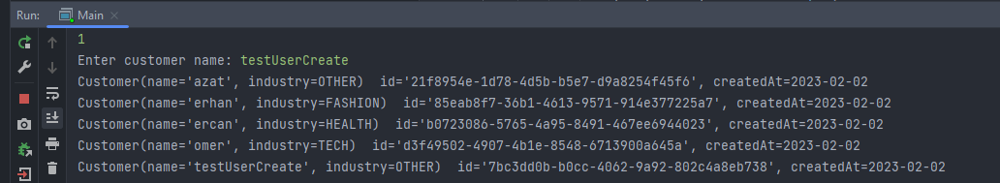
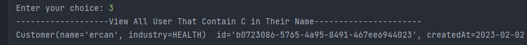
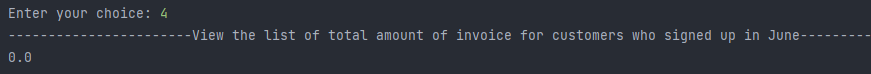
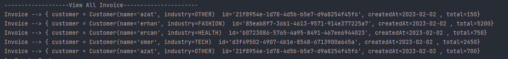
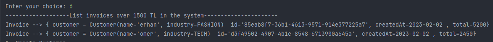
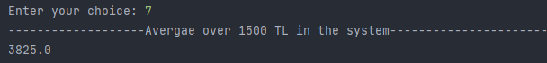
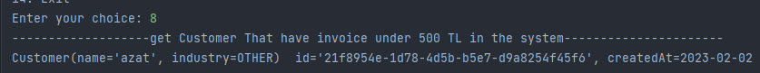

# Order App 
An application for creating and listing orders and invoices for customers.

## Create User and Get All User

##  View Users That Contain 'C' in Their Name

## View the list of total amount of invoice for customers who signed up in June

## View All Invoice

## Listing Invoices Greater than 1500TL

## Average of the Invoices that have Greater Than 1500TL in the System 

## Get Customers That Have Invoice Less than 500Tl in the Systme

##
Show Customer-Industry which Have Average of Invoices Less than 750Tl in the System

